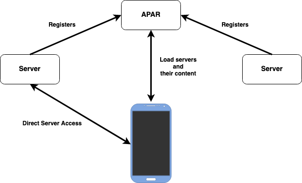

# APAR
**A**ctivity**P**ub **A**ddress **R**egistry - A de-centralized registrar for servers implementing the ActivityPub Specification.

This repository proposes this technology and may include an implementation in the future. APAR is meant to compliment [ActivityPub](https://www.w3.org/TR/activitypub/) by providing a de-centralized location, for servers implementing the ActivityPub specification, to register so that their content is easier to find. Which enables applications and tools to retrieve the registered ActivityPub servers in the [Fediverse](https://en.wikipedia.org/wiki/Fediverse) and query their data. Note that while [ActivityPub](https://www.w3.org/TR/activitypub/) is a W3C Recommendation, APAR is currently not.

### Naming
The name **APAR** is an acronym for ActivityPub Address Registry. After a search, I learned that the [definition](https://www.merriam-webster.com/dictionary/APAR) for an APAR is 
> the three-banded armadillo (Tolypeutes tricinctus) of South America

So that might make a good mascot for this repository in the future. 

## Background
APAR is designed to compliment ActivityPub, but what is [ActivityPub](https://www.w3.org/TR/activitypub/)?

ActivityPub is a W3C Specification, in the Recommendation stage, that details a common protocol for federated social applications. This means that a server that implements the ActivityPub defined protocols is typically interoperable with other servers and clients that also implement the protocols. ActivityPub establishes a standardized, yet extensible, communication protocol for the [Fediverse](https://en.wikipedia.org/wiki/Fediverse).

The Fediverse is a federated network of social applications that can intercommunicate. The ActivityPub specification provides a common approach for that communication. Unlike a traditional and centralized social network (Twitter, Facebook, etc), a federated social network (Mastadon, Diaspora, etc) allows anyone to host their own server and own their own content. These servers can communicate with other servers in the federated network that use the same protocol. In effect, giving the User the ability to interact with other Users from the same or different servers.


One of the most popular federated social networks, that also implements the ActivityPub specification, is [Mastadon](https://joinmastodon.org/). Mastadon is an open-source micro-blogging social network (with some similarities to Twitter). A User can either host their own Mastadon server or join one of the existing Mastadon communities. Either way, the User has the ability to follow, interact, and communicate with any User, even if that User is in another Mastadon community. This ability of server-to-server communication is what makes Mastadon, and the Fediverse in general, so impressive. And with the standardized specification of ActivityPub, it should be possible to communicate between entirely different federated social networks. 

This federated network approach effectively makes these de-centralized social networks. There's no centralized entity that has complete control over all of the network and there's no single point of failure on the network. If one part of the federated network goes down, the rest can remain unaffected. Each server in the network can define their own rules and have their own moderators. If a User chooses that a server doesn't work for them, they can migrate to another server or even create their own and still remain a part of the overall network. This is akin to how the Internet works in general, being de-centralized to some degree, but provides the added benefit of inter-communication between the different parts of the network.

However, a federated social network isn't without it's problems. Some issues that arise on the User level are locating the available communities, displaying the trending content from across communities of interest, and querying for specific information throughout the network. This is where **APAR** comes in. APAR is a registrar for social applications that conform to the ActivityPub Specification. These federated social applications would register their web address with APAR so that their application and content can be found by Users. An application or tool could query APAR to provide a User with this information. This would allow Users to view trending content from across federated social networks, search for specific content, communicate with Users in different communities, and find and join new communities.

Similarities between APAR and a domain registrar may be apparent. In fact, APAR was loosely based on the concept of a domain registrar. However, there are major differences. One important distinction is that APAR doesn't provide Domain Names. The Domain Names must already be registered with a domain registrar before registering the name with APAR. Another distinction between the two technologies is that a domain registrar is typically centralized, whereas, APAR is de-centralized. To be consistent with a federated network's de-centralized nature, APAR was designed to be de-centralized as well. Blockchain is what enables APAR to be de-centralized.

## How does it work?
APAR is a de-centralized registry for ActivityPub implementing social application servers. These social application servers that implement the ActivityPub specification may register with APAR for no cost. Client applications can then use APAR to view the available application servers and load content from them. This would happen "behind the scenes" in the client application, so from the User's perspective, this would be no different than a centralized application. Though the underlying technology APAR uses is a de-centralized Blockchain. This enforces that there is no centralized entity with complete control over the registry; Preventing censorship and creating a level playing field for organizations large and small.



## License
```
Copyright 2020 chRyNaN

Licensed under the Apache License, Version 2.0 (the "License");
you may not use this file except in compliance with the License.
You may obtain a copy of the License at

   http://www.apache.org/licenses/LICENSE-2.0

Unless required by applicable law or agreed to in writing, software
distributed under the License is distributed on an "AS IS" BASIS,
WITHOUT WARRANTIES OR CONDITIONS OF ANY KIND, either express or implied.
See the License for the specific language governing permissions and
limitations under the License.
```
